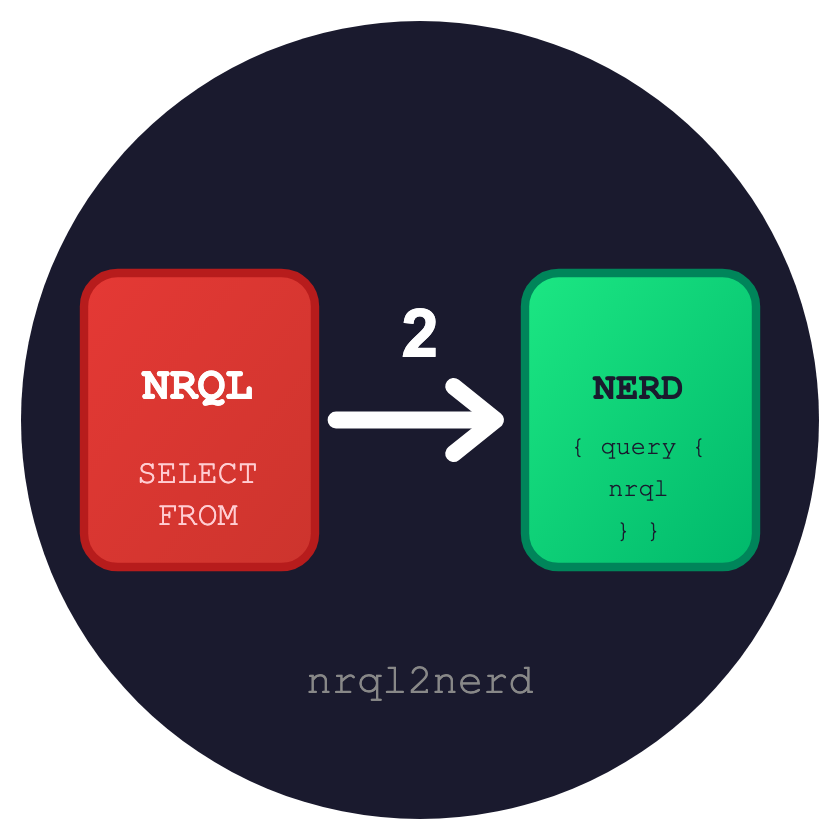

<p align="center">
  
</p>

<h1 align="center">NRQL2Nerd</h1>

<p align="center">
  <a href="https://github.com/saiden-dev/nrql2nerd/actions/workflows/main.yml"></a>
  <a href="https://badge.fury.io/rb/nrql2nerd"></a>
  <a href="https://github.com/rubocop/rubocop"></a>
</p>

<p align="center">
  A lightweight Ruby gem for executing NRQL queries against New Relic's NerdGraph API.<br/>
  Skip the boilerplate and get straight to your data.
</p>

## Features

- Simple, intuitive API for NRQL queries
- Works as a library or command-line tool
- Environment variable or explicit credential configuration
- Returns parsed JSON results ready for use

## Installation

Add to your Gemfile:

```ruby
gem "nrql2nerd"
```

Or install directly:

```bash
gem install nrql2nerd
```

## Configuration

Set your New Relic credentials via environment variables:

```bash
export NEW_RELIC_API_KEY="your-api-key"
export NEW_RELIC_ACCOUNT_ID="your-account-id"
```

Or pass them explicitly when creating a client.

## Usage

### As a Library

```ruby
require "nrql2nerd"

client = NRQL2Nerd::Client.new
results = client.run_query("SELECT count(*) FROM Transaction SINCE 1 hour ago")

# => [{"count" => 42}]
```

With explicit credentials:

```ruby
client = NRQL2Nerd::Client.new(
  api_key: "your-api-key",
  account_id: "12345"
)
```

### Command Line

```bash
# Using environment variables
nrql2nerd -q "SELECT count(*) FROM Transaction SINCE 1 hour ago"

# With explicit credentials
nrql2nerd -q "SELECT * FROM Transaction LIMIT 10" \
  --api-key your-api-key \
  --account-id 12345
```

A shorter alias `n2n` is also available:

```bash
n2n -q "SELECT count(*) FROM PageView SINCE 1 day ago"
```

## Development

```bash
bin/setup          # Install dependencies
bundle exec rake   # Run tests and linting
bin/console        # Interactive prompt
```

## Contributing

Bug reports and pull requests are welcome on [GitHub](https://github.com/aladac/nrql2nerd). Please follow the [code of conduct](https://github.com/aladac/nrql2nerd/blob/main/CODE_OF_CONDUCT.md).

## License

Available as open source under the [MIT License](https://opensource.org/licenses/MIT).
